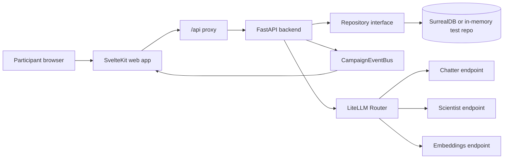
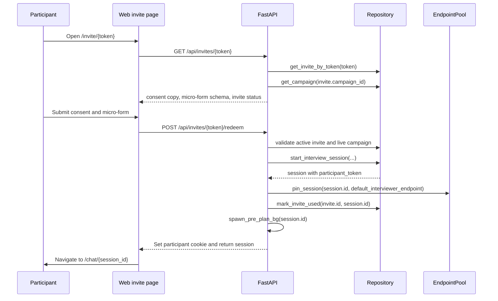
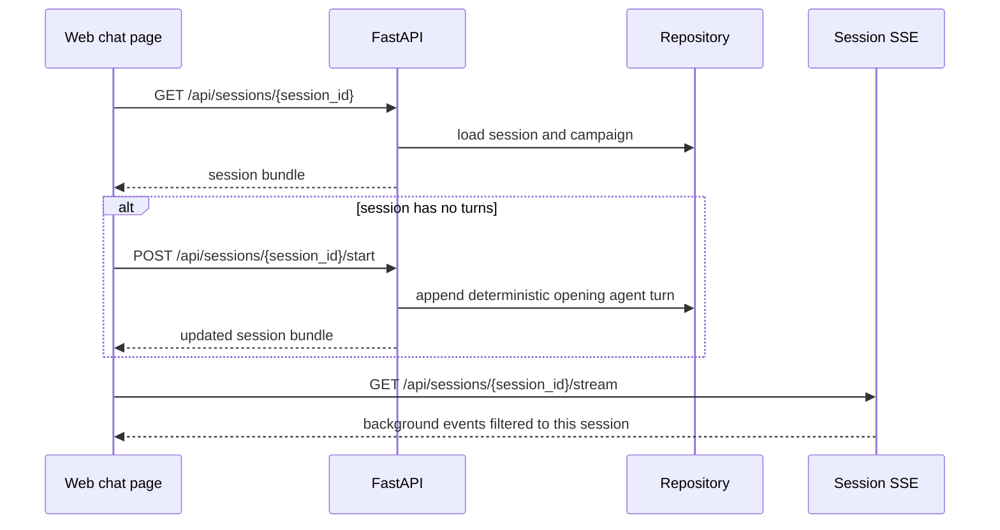
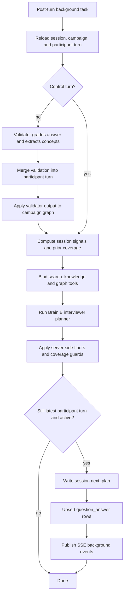
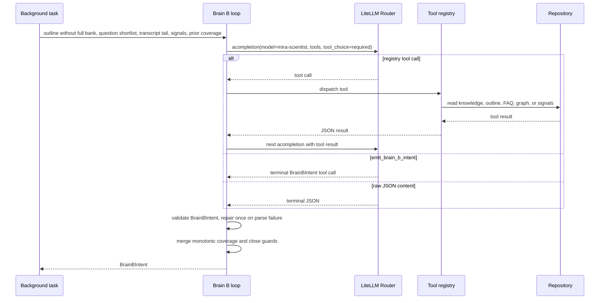
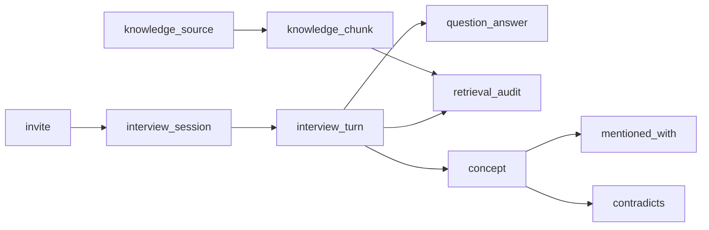
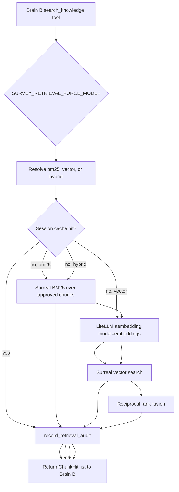
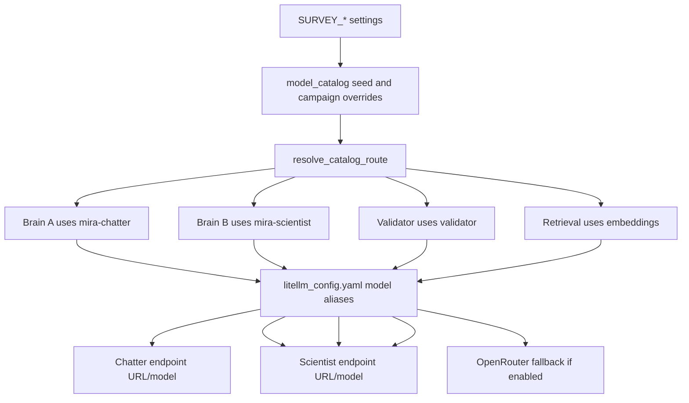

# Interview Critical Path

This document traces the participant interview path as implemented today. It
focuses on runtime behavior: how a session begins, how participant messages move
through Brain A and Brain B, what is written to storage, and how AI services are
routed.

Primary code paths:

- Frontend invite page: `apps/web/src/routes/invite/[token]/+page.svelte`
- Frontend chat page: `apps/web/src/routes/chat/[session_id]/+page.svelte`
- API invite route: `services/api/agentic_survey/api/invites.py`
- API session route: `services/api/agentic_survey/api/sessions.py`
- Interview loop: `services/api/agentic_survey/engine/interview_loop.py`
- Brain A: `services/api/agentic_survey/agents/brain_a.py`
- Brain B: `services/api/agentic_survey/agents/brain_b_interviewer.py`
- Shared Brain B tool loop: `services/api/agentic_survey/agents/brain_b_loop.py`
- Validator: `services/api/agentic_survey/agents/validator.py`
- Graph writes: `services/api/agentic_survey/engine/graph_builder.py`
- Retrieval: `services/api/agentic_survey/services/retrieval.py`
- LLM routing: `services/api/agentic_survey/llm/`
- Repository contract and Surreal implementation:
  `services/api/agentic_survey/repository.py`,
  `services/api/agentic_survey/db/surreal_repository.py`,
  `services/api/agentic_survey/db/schema.surql`

## System Map



The participant shell uses normal HTTP calls for state-changing work and an SSE
connection for live/background updates. `POST /sessions/{id}/turns` still waits
for the full Brain A reply before returning the refreshed session bundle, but
Brain A token chunks are also emitted as live-only `token` SSE events while the
request is in flight so the participant sees Mira composing.

## Interview Start



What is persisted on redeem:

- `invite.status` becomes `used` and points at the new session.
- `interview_session` is created with:
  - campaign and invite references
  - private `participant_token` cookie value
  - consent mode and optional identity label
  - `micro_form_answers`
  - `persona_snapshot`
  - `pinned_endpoint`
  - `status="active"`
  - `next_plan=null`
  - `preplan_status="pending"`
- In Surreal mode, the session also stores an `outline_snapshot` reference to
  the latest outline revision.

When the chat page mounts:



The opening turn is deterministic. It does not call an LLM. The text is built by
`opening_turn_message(campaign, session)` from the outline, consent mode, and
micro-form answers.

Invite redemption schedules `spawn_pre_plan_bg(...)` for the fresh session.
`POST /sessions/{id}/start` also schedules the same single-flight dispatcher if
no ready plan exists yet. If the pre-plan is late or fails, the first
substantive participant turn still degrades to the deterministic scaffold
intent, and Brain B plans the following turn in the post-turn background task.

## Participant Turn: Foreground Path

```mermaid
flowchart TD
    Start[POST /sessions/{sid}/turns]
    Access[Authorize participant cookie or admin session]
    Cancel[Cancel in-flight pre-plan if present]
    Load[Load active session and campaign]
    PersistUser[Append participant interview_turn]
    Control{Control signal?}
    Pause[Pause session]
    Stop[Stream closing Brain A reply and finish session]
    Plan{session.next_plan exists?}
    UsePlan[Use Brain B plan and clear next_plan]
    Scaffold[Build scaffold BrainBIntent]
    BrainA[Resolve chatter route and stream Brain A]
    PersistAgent[Append agent interview_turn with BrainBIntent and chips]
    Return[Return refreshed session bundle]
    Spawn[Spawn post-turn background task]

    Start --> Access --> Cancel --> Load --> PersistUser --> Control
    Control -- pause --> Pause --> Return
    Control -- stop --> Stop --> Return
    Control -- skip or continue or substantive --> Plan
    Plan -- yes --> UsePlan --> BrainA
    Plan -- no --> Scaffold --> BrainA
    BrainA --> PersistAgent --> Return --> Spawn
```

Foreground behavior:

- The participant message is persisted before any AI work.
- Substantive messages get a placeholder validation payload:
  `{"pending_validation": true, "objective_tags": []}`.
- Control messages get `{"control_signal": "...", "objective_tags": []}`.
- `pause` stops immediately after updating the session.
- `stop` asks Brain A for short closing prose, persists an agent closing turn,
  then finishes the session.
- `skip`, `continue`, and substantive answers continue into Brain A.
- If `session.next_plan` exists, it is consumed and cleared before rendering.
- If no plan exists, Brain A receives a deterministic scaffold intent.
- Brain A is called through the `mira-chatter` alias, with chatter catalog
  reasoning settings and temperature applied.
- The final agent turn stores:
  - visible reply text
  - `brain_b_intent`
  - `get_user_input` chip options
  - `validation.planner_source`, either `brain_b` or `scaffold`

The HTTP route returns after the Brain A reply is complete. It publishes
non-token events to the campaign event bus; token chunks are collected inside
the foreground result but are not sent over the session SSE stream today.

## Participant Turn: Background Path

After the HTTP response, `spawn_post_turn_bg(...)` runs
`run_post_turn_background(...)` in an `asyncio` task.



Background events published on success:

- `validator_scored`
- `graph_delta`
- `concepts_extracted`
- `brain_b_planned`

These events are persisted as `interview_event` rows before they are published
to the in-process campaign bus. Pre-plan warmup also persists
`preplan_ready`, `preplan_late_skipped`, or `preplan_failed` where applicable.

If the background task raises, the exception is logged and the agent turn's
validation dict is marked with `background_failed=true`. The exception is not
raised back to the already-completed participant request.

Control-signal turns skip Validator and graph writes. They can still lead to a
Brain B plan if the session is active and the control was `skip` or `continue`.

## Brain B Planner Loop



Brain B tools available in live interviews:

- `search_knowledge`
- `get_outline_state`
- `list_grounding_sources`
- `list_participant_faq`
- `get_session_signals`
- `get_graph_neighborhood`

Live interview Brain B does not get web-search tools and does not get the
designer-only outline patch tool. The campaign outline is locked for the
participant surface.

Brain B safeguards:

- `tool_choice="required"` so the model must commit to a tool or final intent.
- `parallel_tool_calls=false` so the orchestrator receives one sequential tool
  decision rather than an unbounded parallel fan-out.
- Duplicate tool calls in a single response are deduped.
- Per-response and per-turn tool-call budgets cap runaway tool output.
- The terminal output is validated as `BrainBIntent`.
- One parse-repair iteration is attempted before raising.
- Axes coverage is normalized, clamped, and monotonic against prior coverage.
- Brain B sees a server-ranked shortlist of eligible question intents, while
  question coverage is still filtered against the full eligible question ids.
- Mandatory close axes can prevent premature `should_close=true`.
- Campaigns can also declare `minimum_close_coverage_axes` so a normal close
  requires broader non-zero evidence coverage; participant-led completion can
  still close once mandatory axes are satisfied.

## Database Writes



Important write points:

- Invite redemption writes `interview_session` and marks the `invite` used.
- Invite redemption persists a `session_created` `interview_event`.
- `/sessions/{id}/start` writes the deterministic opening `interview_turn`.
- `/sessions/{id}/start` persists a `session_started` `interview_event`.
- Each participant message writes a participant `interview_turn`.
- Each participant message persists `turn_start` and `participant_turn`
  `interview_event` rows.
- Each Mira response writes an agent `interview_turn`.
- Each Mira response persists `turn_complete`; pause/finish paths persist
  `session_paused` and `session_finished`.
- Validator output is merged into `interview_turn.validation` and upserted to
  the queryable `validator_result` row keyed by participant turn.
- Graph extraction writes or updates `concept`, `mentioned_with`, and
  `contradicts`.
- Brain B question coverage changes write `question_answer`.
- Knowledge retrieval writes one `retrieval_audit` row per `search_knowledge`
  tool call.
- Brain B plans carry `retrieval_audit_ids`; the rendered agent turn stores the
  primary `retrieval_audit_id` so admin audit views can load the exact retrieval
  rows used by that turn.
- `interview_event` stores durable lifecycle events with campaign, optional
  session/turn, event name, payload, created_at, and per-campaign `sequence`.
  Admin endpoints can query by campaign or session; SSE reconnects can replay
  durable rows when the in-memory bus ring is empty after process restart.
- `llm_audit` stores structured LiteLLM completion audit rows with surface,
  brain/role, optional campaign/session/turn, model alias, catalog/route,
  endpoint metadata, latency, status/error summary, token counts, reasoning
  metadata, metadata, and created_at. Raw prompt/response text is not persisted.

## Retrieval And Grounding



Retrieval is synchronous and repository-backed. Live participant turns do not
call the web. Brain B can read approved campaign knowledge through Surreal BM25,
vector search, or hybrid search. Hybrid/vector modes call the `embeddings`
LiteLLM alias to embed the query, then search the Surreal MTREE index.

## AI Service Routing



Role behavior:

- Chatter routes to `mira-chatter`.
  - Used by Brain A for visible prose.
  - Reasoning is off.
  - Temperature comes from `SURVEY_CHATTER_TEMPERATURE`.
- Scientist routes to `mira-scientist`.
  - Used by Brain B for planning and tool use.
  - Reasoning is controlled by `SURVEY_SCIENTIST_SUPPORTS_REASONING`.
  - Temperature comes from `SURVEY_SCIENTIST_TEMPERATURE`.
- Validator routes to `validator`.
  - Called by `LLMClient.chat(...)`.
  - Uses `temperature=0.0` and disables reasoning.
  - Repairs malformed JSON once.
- Embeddings route to `embeddings`.
  - Used by query embedding and concept/knowledge vector operations.
  - Defaults to the scientist endpoint unless
    `SURVEY_EMBEDDING_ENDPOINT_URL` is set.

LiteLLM success and failure callbacks log `llm_call_audit` JSON and persist the
same structured audit data to `llm_audit`. Direct streaming/tool-calling paths
that bypass `LLMClient` manually invoke the same callbacks with request metadata
so Brain A, Brain B, Validator, Designer, and retrieval embedding calls share
one queryable audit surface.

## SSE Events Seen By The Chat Page

The chat page opens:

```text
GET /api/sessions/{session_id}/stream
```

The backend subscribes to the campaign event bus, replays events after the
requested cursor, and filters each event to `data.session_id == session_id`.

The participant chat page listens for:

- `token`
- `brain_b_planned`
- `validator_scored`
- `concepts_extracted`
- `graph_delta`
- `turn_complete`
- `session_finished`
- `session_paused`

The route may publish `get_user_input` as part of the foreground event list, but
the current chat page does not listen for that event over SSE because the
refreshed session bundle already includes the agent turn and chip options.

`token` is live-only: it is delivered to current session SSE subscribers without
entering the durable `interview_event` table or campaign replay ring. Campaign
streams filter token events so operator graph cursors are not polluted by
participant-facing prose chunks.

## Failure And Degradation Rules

- Invite redemption fails fast if the invite is missing, inactive, or the
  campaign is not live or monitoring.
- Participant turns fail fast if the session is paused or not active.
- Missing Brain B plans degrade to a scaffold intent for the visible Brain A
  response.
- Background failures are recorded on the agent turn and logged; they do not
  invalidate the already-returned participant response.
- Retrieval embedding failures do not silently fall back to BM25. Operators can
  force BM25 with `SURVEY_RETRIEVAL_FORCE_MODE=bm25`.
- LLM routing failures raise through `LiteLLMRouterError` or `LLMUnavailable`.
- Validator malformed JSON gets one repair pass.
- Brain B malformed intent gets one parse-repair pass.
